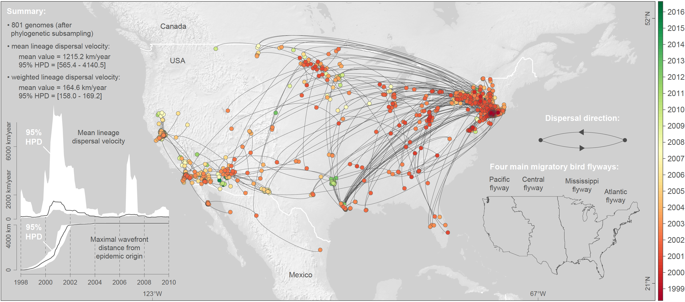

This repo gathers the input files and scripts related to our study entitled "**Epidemiological hypothesis testing using a phylogeographic and phylodynamic framework**" ([Dellicour *et al*. 2020](https://www.nature.com/articles/s41467-020-19122-z), *Nature Communications*): BEAST XML files of the continuous phylogeographic and skygrid-GLM analyses, as well as R scripts and related files needed to run all the landscape phylogeographic testing analyses. Continuous phylogeographic and phylodynamic (skygrid-GLM) inferences were performed with the Bayesian methods implemented in the open-source program [BEAST](http://github.com/beast-dev/beast-mcmc). Subsequent dispersal statistics estimation and landscape phylogeographic analyses were implemented and performed with R functions available in the package "[seraphim](https://github.com/sdellicour/seraphim)", using scripts gathered in the file `R_script_analyses.r`.

Abstract: Computational analyses of pathogen genomes are increasingly used to unravel the dispersal history and transmission dynamics of epidemics. Here, we show how to go beyond historical reconstructions and use spatially-explicit phylogeographic and phylodynamic approaches to formally test epidemiological hypotheses. We illustrate our approach by focusing on the West Nile virus (WNV) spread in North America that has substantially impacted public, veterinary, and wildlife health. We apply an analytical workflow to a comprehensive WNV genome collection to test the impact of environmental factors on the dispersal of viral lineages and on viral population genetic diversity through time. We find that WNV lineages tend to disperse faster in areas with higher temperatures and we identify temporal variation in temperature as a main predictor of viral genetic diversity through time. By contrasting inference with simulation, we find no evidence for viral lineages to preferentially circulate within the same migratory bird flyway, suggesting a substantial role for non-migratory birds or mosquito dispersal along the longitudinal gradient.

**Figure: spatio-temporal diffusion of WNV lineages in North America..** Maximum clade credibility (MCC) tree obtained by continuous phylogeographic inference based on 100 posterior trees (see the text for further details). Nodes of the tree are coloured from red (the time to the most recent common ancestor, TMRCA) to green (most recent sampling time). Older nodes are plotted on top of younger nodes, but we provide also an alternative year-by-year representation in Supplementary Figure S1. In addition, this figure reports global dispersal statistics (mean lineage dispersal velocity and mean diffusion coefficient) averaged over the entire virus spread, the evolution of the mean lineage dispersal velocity through time, the evolution of the maximal wavefront distance from the origin of the epidemic, as well as the delimitations of the North American Migratory Flyways (NAMF) considered in the USA.

### System requirements

- BEAST: the program runs on any operating system and requires the installation of the BEAGLE library for fast computations (https://github.com/beagle-dev/beagle-lib). Version of BEAST used in the present study: 1.10.4
- "seraphim": the R package was mainly tested on Unix operating systems and requires the preliminary installation of several other R packages listed in the manual provided with the package

### Installation guide

- instructions to install BEAST: http://beast.community/installing
- instructions to install BEAGLE: https://github.com/beagle-dev/beagle-lib
- instructions to install "seraphim": https://github.com/sdellicour/seraphim

(Typical install time on a "normal" desktop computer: very variable)

### Demo and instructions for use

The file `R_script_analyses.r` gathers all the R scripts used to perform the different post hoc landscape phylogeographic analyses. In addition, there are also several existing tutorial allowing to perform the same analyses:
- instructions to run a continuous phylogeographic analysis in BEAST: tutorial available [here](https://beast.community/workshop_continuous_diffusion_yfv). Output: time-scaled annotated phylogenetic trees. Run time: several weeks, depending on the computational resources
- instructions to estimate dispersal statistics with "seraphim": tutorial available [here](https://github.com/sdellicour/seraphim/blob/master/tutorials/Estimating_dispersal_statistics.pdf) (related example files are available in the directory with the same name). Output: estimated dispersal statistics (graphics, mean/median values, HPD intervals). Run time: < 1 hour
- instructions to use "seraphim" to perform relaxed random walk (RRW) simulations along posterior trees: tutorial available [here](https://github.com/sdellicour/seraphim/blob/master/tutorials/RRW_simulations_along_trees.pdf) (related example files are available in the directory with the same name). Output: spatially-annotated posterior trees along which a new RRW diffusion process has been re-simulated. These simulations are used to generate a null dispersal model, which is further exploited to test the impact of environmental factors on the dispersal location and velocity of viral lineages, as well as to test the impact of migratory bird flyways on the dispersal frequency of viral lineages. Run time: several hours when ran in parallel on several CPUs
- instructions to test the impact of environmental factors on lineage dispersal locations with "seraphim": tutorial available [here](https://github.com/sdellicour/seraphim/blob/master/tutorials/Impact_on_dispersal_direction.pdf) (related example files are available in the directory with the same name). Output: distribution of *E* statistics (see the text for further detail) and statistical support (Bayes factors) for each environmental factor. Run time: < 1 day
- instructions to test the impact of environmental factors on lineage dispersal velocity with "seraphim": tutorial available [here](https://github.com/sdellicour/seraphim/blob/master/tutorials/Impact_on_dispersal_velocity.pdf) (related example files are available in the directory with the same name). Output: distribution of *Q* statistics (see the text and Appendix for further detail) and statistical support (Bayes factors) for each environmental factor. Run time: several days when ran in parallel on several CPUs

